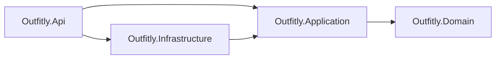
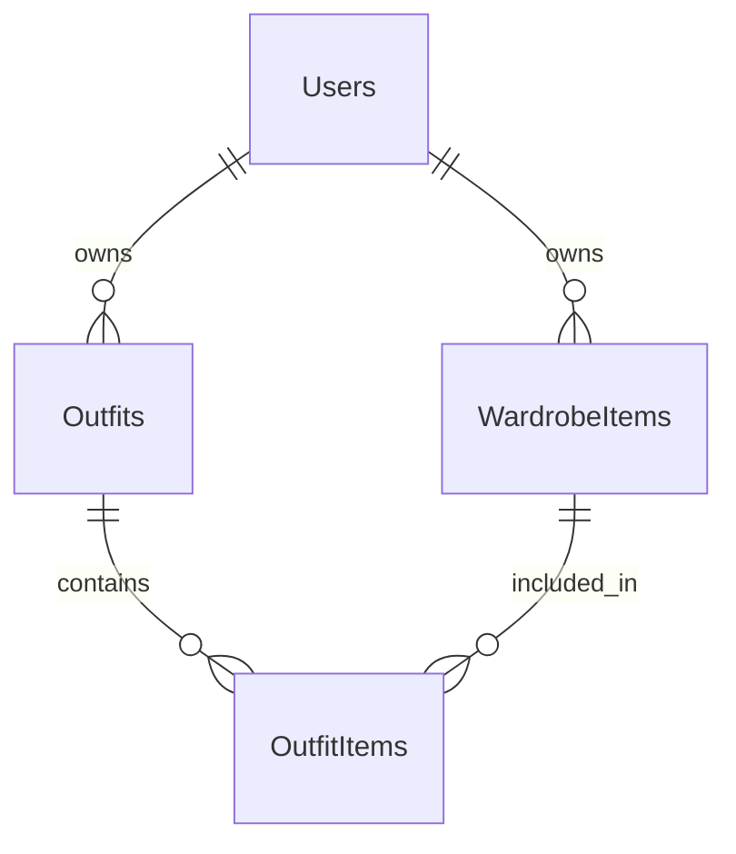
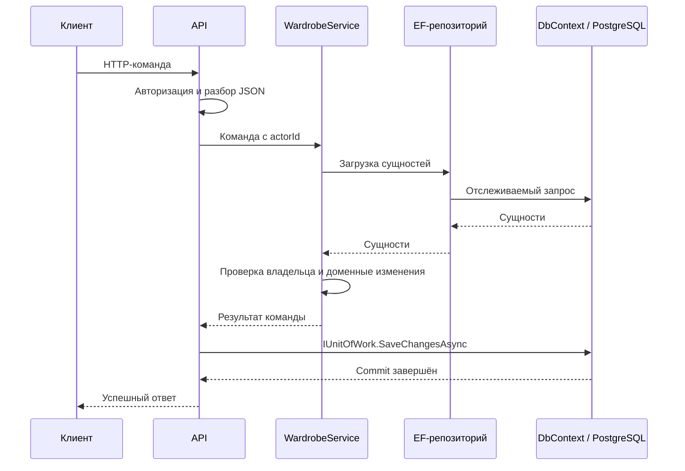

# Архитектура проекта

Этот документ объясняет ответственность слоёв и важные ограничения.

## Назначение и состояние

Outfitly — учебное приложение для личного гардероба: вещи по категориям,
их характеристики, составление образов и доступ к вещам/образам по ссылке.
Первая версия ограничена этими сценариями.

Backend реализован на .NET 10: доменная модель, use cases, EF Core/PostgreSQL
и базовый HTTP API. Frontend — отдельный каркас HTML/CSS/JavaScript без фреймворка;
интеграция интерфейса с операциями API ещё не реализована.

Аутентификация отложена. Production-схема `Pending` не создаёт identity:
защищённые маршруты возвращают `401`. Публичные списки и активные ссылки
доступны анонимно при настроенной БД.

## Структура и зависимости

```text
src/backend/
  Outfitly.Domain/          # Сущности и доменные правила
  Outfitly.Application/     # Use cases, порты, DTO
  Outfitly.Infrastructure/  # EF, PostgreSQL, миграции
  Outfitly.Api/             # HTTP, авторизация, DI
src/frontend/              # HTML/CSS/JavaScript
tests/backend/Outfitly.Tests/{Domain,Application,Infrastructure,Api}/
tests/frontend/
docs/
```

Стрелка означает зависимость проекта, а не направление выполнения запроса.



| Слой | Ответственность | Что не размещаем |
| --- | --- | --- |
| Domain | User, WardrobeItem, Outfit, ShareLink; валидация и переходы состояния | EF, HTTP, identity, DI |
| Application | WardrobeService; владение, выбор ресурсов, координация удаления; IWardrobeRepository, IUnitOfWork, DTO | DbContext, SQL, маршруты и HTTP-коды |
| Infrastructure | EfWardrobeRepository, OutfitlyDbContext, конфигурации и миграции; реализация портов | HTTP-ответы и бизнес-сценарии |
| Api | Контракты запросов, серверная identity, политики, маршруты, commit filter, ProblemDetails; composition root | Дублирование доменных правил, OwnerId из тела запроса |

Infrastructure использует доменные типы через транзитивную зависимость
Application → Domain. Domain не зависит от других слоёв. Frontend взаимодействует
с backend по HTTP; правила гардероба выполняются на сервере.

## Доменная модель

| Сущность | Данные и назначение |
| --- | --- |
| User | ID владельца и отображаемое имя; без учётных данных |
| WardrobeItem | Владелец, имя, категория, цвет, размер, бренд, описание, URL фото, публикация |
| Outfit | Владелец, имя, описание, публикация, состав из вещей владельца |
| ShareLink | Уникальный токен, тип/ID цели, активность |

Категории заданы enum `ClothingCategory`, отдельной сущности категории нет.
Идентификаторы задаются приложением. Обязательные имена нормализуются и не могут
быть пустыми; пустые необязательные поля становятся `null`.
Фото задаётся абсолютным HTTP/HTTPS URL; файлового хранилища нет.

Образ содержит только вещи своего владельца без дубликатов по ID.
Пустой черновик разрешён, публикация и создание ссылки для него запрещены.
Публикация и ссылки независимы: снятие публикации не отзывает ссылку.
Опубликованный/расшаренный образ показывает приватные вещи в своём контексте,
но не публикует их отдельно.

Удаление вещи убирает её из всех образов и отзывает ссылки на вещь.
Опустевшие образы становятся приватными, их ссылки отзываются.
Удаление образа сохраняет вещи и отзывает ссылки на образ.
Повторное заполнение не восстанавливает старые ссылки.

## Хранение

EF-маппинги находятся в Infrastructure, без EF-атрибутов в Domain.
Таблицы: Users, WardrobeItems, Outfits, OutfitItems и ShareLinks.



OutfitItems — таблица связи, а не отдельная доменная сущность.
Ключ `(OutfitId, WardrobeItemId)` запрещает повтор вещи. Оба внешних ключа
включают OwnerId и запрещают связывать вещи/образы разных владельцев.
Удаление образа каскадно удаляет связи; удаление ещё используемой вещи
и владельца с гардеробом ограничено внешними ключами.

Enum хранятся строками. Токен ссылки имеет уникальный индекс и восстанавливается
без повторной генерации. Полиморфная цель ShareLink не имеет внешнего ключа:
доступность и отзыв проверяет Application. Отозванные ссылки сохраняются.

## Запрос и граница сохранения



Это путь успешной команды после подключения аутентификации. Сейчас production-запрос
останавливается на авторизации; HTTP-тесты проходят этот путь с тестовой identity.

WardrobeService, репозиторий и DbContext имеют scoped lifetime.
IUnitOfWork зарегистрирован как тот же DbContext. CommitChangesFilter применяется
только к командам и сохраняет изменения перед успешным ответом.
При исключении или ошибочном результате команды commit не выполняется.
Удаление вещи, обновление образов и отзыв ссылок сохраняются одной транзакцией EF.

EF отслеживает изменения через доменные методы. Репозиторий учитывает pending additions
и исключает pending deletions. После ошибки сохранения scope завершается:
откат БД не восстанавливает состояние объектов в памяти.

OwnerId берётся из ClaimTypes.NameIdentifier с непустым Guid. Application дополнительно
проверяет владельца ресурса. Создание доменного User при регистрации/первом входе
предстоит реализовать вместе с аутентификацией; БД уже требует существующего User.
HTTP возвращает DTO, а не сущности. Токен выдаётся при создании ссылки и не входит
в обычные просмотры. Ошибки возвращаются как ProblemDetails.
Точные маршруты описаны в [README API](../src/backend/Outfitly.Api/README.md).

Текущий DTO-контракт включает OwnerId; запрет раскрытия этого поля не установлен.

## Проверки и ограничения

Domain/Application проверяются через публичное поведение без моков БД.
Реляционные тесты используют изолированную SQLite; HTTP-тесты — реальный pipeline
через WebApplicationFactory. PostgreSQL-тесты применяют миграции в отдельных схемах
и явно пропускаются без тестовой строки подключения.
Подробнее — [стратегия тестирования](../tests/backend/Outfitly.Tests/README.md).

Репозиторий синхронный и загружает коллекции целиком. Фильтрация в БД,
async-запросы и пагинация пока не добавлены. API не применяет миграции автоматически.
Аутентификация, интеграция frontend, загрузка файлов и эксплуатационная инфраструктура
не считаются реализованными.
